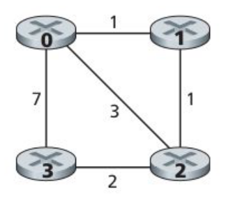

# computer-networks

Contains the computer assignment and the course project for the Fall 2020
Computer Networks course.

### Computer Assignment

---
This assignment's task is to build a Distance-Vector algorithm for a small
network containing 4 nodes shown below:

<p align="center" width="100%">

</p>

We need to implement the functions below for each node and run them
asynchronously:

`rtinit()`:
- It has no input arguments.
- Initializes node's distance table.
- After initialization, sends the vector of minimum-cost path to all nodes 
to all of the neighboring nodes.
- The information about minimum-cost path should be wrapped in a 
`routing packet` object and sent via `toNode()` function. The `routing packet` 
object could look something like this (written in C):
    ```c
    extern struct rt_pkt {
        int source_id;  // sender id (0-3)
        int destination_id;  // receiver immediate neighbor id
        int min_cost[4];  // min cost to nodes 0-3
    }
    ```

`rtUpdate()`:
- This function is called whenever a node receives a `routing packet` object 
from one of its neighbors.
- We should update the distance table based on the `routing packet` object and
announce the new distance table to the neighbors via `toNode()` function
(if any changes were made).

**Notes:**
- We should create these two functions for all of the 4 nodes.
- Each node's functions should be placed in a separate file and ran separately.
- A simple message should be printed each time a function is called.
